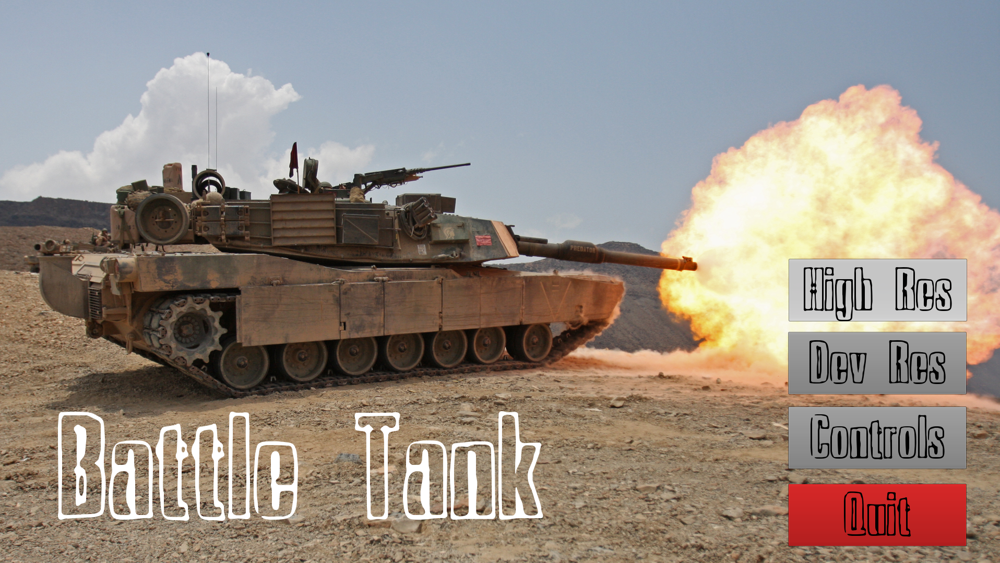
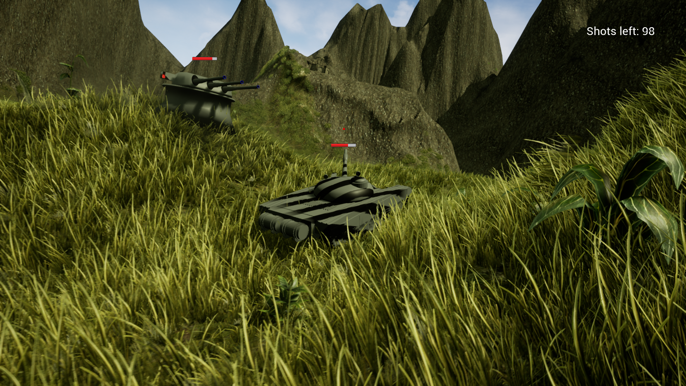

# BattleTank

An open-world head-to-head tank fight with simple AI. The game showcases relatively advanced control systems, physics interactions, and terrain in Unreal 4.

Commits before BT260 do not work unless the unreal starter content pack is added to the game. BT260 fixes that dependency and adds the necessary files to source control.

Enjoy these screenshots, which give a feel for the game.

